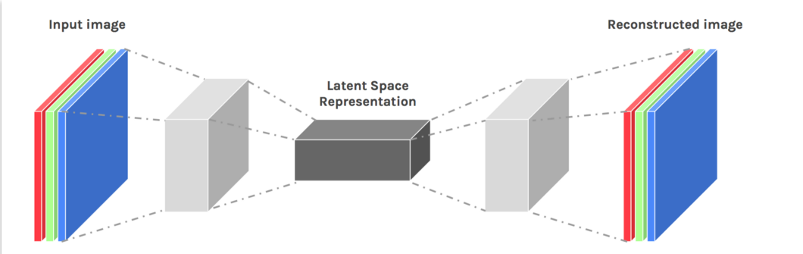
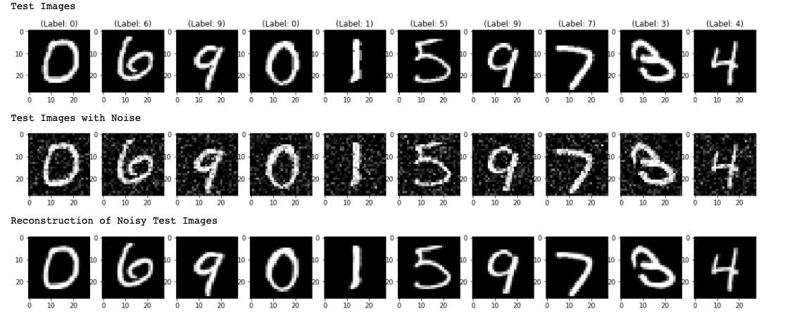

# Image Noise Removal

## Introduction

Similar to generative adversarial networks, autoencoders work by learning the latent space representation of the data that is fed in. The latent space contains all the necessary information to recreate the features of the original data. 

In this project, I used an autoencoder to remove salt and pepper noise from corrupted images. It is important to highlight that this type of neural network could be easily applied to another type of problems like increasing resolution of images, image colorization, film restoration, and background removal.

## Dataset

For this project, I used the MNIST. MNIST is a simple computer vision dataset. It consists of images of handwritten digits. It also includes labels for each image, telling us which digit it is. The MNIST data is split into two parts: 60,000 data points of training data, and 10,000 points of test data. Each image is 28 pixels by 28 pixels.. A more diverse dataset could have yield better results and a more reliable and widely applicable model.

## Methodology

The first step of this project was to generate noisy images. Let's first define a noise factor which is a hyperparameter. The noise factor is multiplied with a random matrix that has a mean of 0.0 and standard deviation of 1.0. This matrix will draw samples from normal (Gaussian) distribution. The shape of the random normal array will be similar to the shape of the data you will be adding the noise.

The autoencoder is composed of 9 layers: 

- **Layers 1-4:** The first 4 layers are Conv2D layers with batch normalization, Leaky ReLU activation, and a decreasing number of filters.
- **Layers 5-8:** The next 4 layers are Conv2DTranspose layers which could be considered the inverse of a Conv2D layer. These layers also have batch normalization, Leaky ReLU activation, but unlike the first four layers, the numbers of filters is increasing on each layer.
- **Layer 9:** Finally, the output layer is a Conv2DTranspose layer with sigmoid activation.

The model that I present differs from a traditional deep convolutional autoencoder mainly on the use of batch normalization and Leaky ReLU. The rationale behind my improvements is the following:

- **Batch Normalization:** By normalizing the inputs of each layer for each batch, I can limit how much the distribution of the inputs received by the current layer is affected by the previous layer. This decreases any possible interdependence between different parameters, and it helps increasing the training speed and the reliability of the model.
- **Leaky ReLU:** Unlike the ReLU activation function, Leaky ReLU can prevent gradients from dying by allowing a small positive gradient instead of zero. 

## Results

The results were satisfactory, but they are still far from being perfect. The most notorious issue is the blurriness and discoloration of the output images. The model preforms in a suboptimal way when the amount of noise in an image is relatively low, however, it delivers impressive results when the image is highly noisy and corrupted. The images below were randomly drawn from the validation set.

